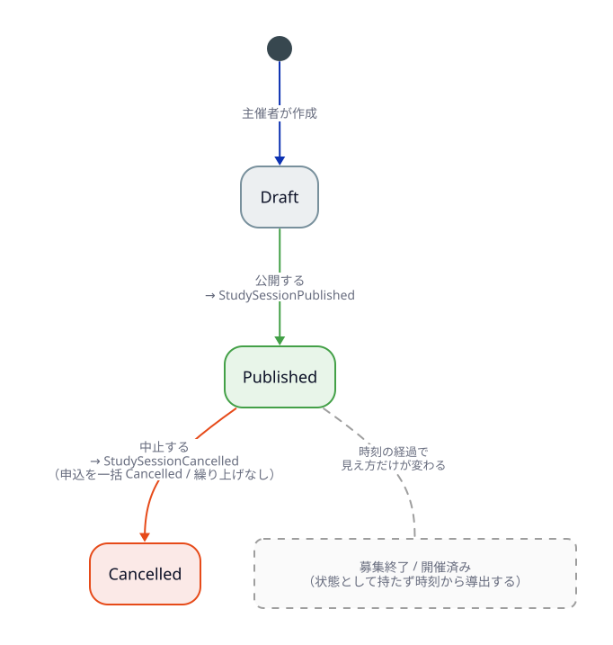
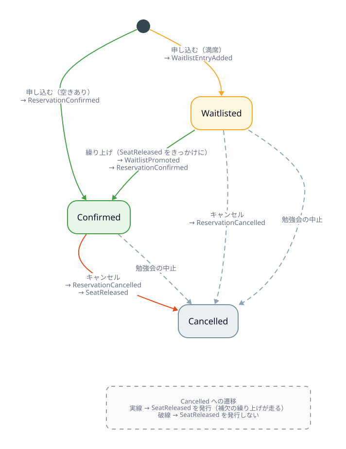
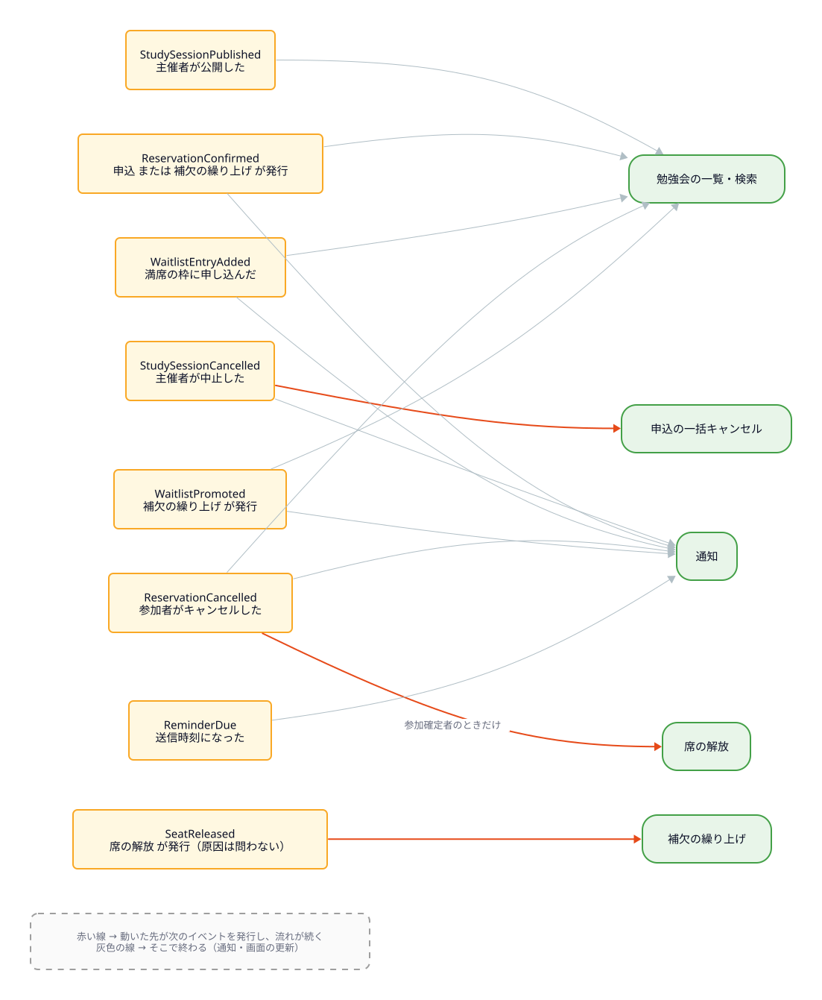

# 勉強会予約サービスの要件

## 目的

イベント駆動アーキテクチャの学習用サンプル。
「勉強会を探して申し込む」という題材で、イベントの発行・配送・購読を扱う。

> イベント発行にする・しないの境界は「その出来事を、別の処理が知りたがるか？」

## ユーザー

### 参加者
- 勉強会を探す・閲覧する
- 参加枠を選んで申し込む
- 満席なら補欠として待ち、繰り上げを受ける
- 申し込みをキャンセルする

### 主催者
- 勉強会を作成し、公開する
- 参加枠と定員を設定する
- 参加者・補欠の一覧を確認する
- 勉強会を中止する

## ドメインモデル

### 勉強会 (StudySession)

| 属性 | 説明 |
|---|---|
| タイトル / 説明 | |
| 開催日時 | |
| 主催者 | |
| 募集締切 | この時刻を過ぎると申し込めない |
| キャンセル期限 | この時刻を過ぎるとキャンセルできない |
| 参加枠 | 1つ以上 |
| 状態 | `Draft` / `Published` / `Cancelled` |

募集方式は**先着順のみ**とする（抽選は扱わない）。

### 参加枠 (TicketType)

「一般枠 20名 / LT枠 5名 / 学生枠 10名」のように、**定員は参加枠ごとに独立して存在する**。

| 属性 | 説明 |
|---|---|
| 名前 | 一般枠、LT枠、学生枠 など |
| 定員 | |

### 申込 (Application)

| 属性 | 説明 |
|---|---|
| 勉強会 / 参加枠 / 参加者 | |
| 状態 | `Confirmed` / `Waitlisted` / `Cancelled` |
| 補欠順位 | `Waitlisted` のときのみ。参加枠ごとの連番 |

## 不変条件

1. **参加確定者数 ≤ 参加枠の定員**（参加枠ごとに判定）
2. **同一参加者は同一勉強会に有効な申込を1件しか持てない**（キャンセル済みは除く）
3. 補欠順位は参加枠内で一意かつ 1 からの連番である
4. 募集期間外は申し込めない
5. キャンセル期限を過ぎたらキャンセルできない

## 集約境界

**勉強会集約 = 勉強会 + 参加枠 + 申込**

参加枠を独立した集約にすると、不変条件2（同一勉強会への重複申込の防止）が
枠をまたぐため守れない。したがって勉強会を集約ルートとし、
定員チェックと重複チェックを同一トランザクションで行う。

トランザクション境界が勉強会単位になるため、人気勉強会には書き込みが集中するが、
勉強会が異なれば競合しない。

## 状態遷移

### 勉強会



永続化するのはこの3状態のみ。「募集終了」「開催済み」は**状態として持たず、時刻から導出する**。

```
募集終了 = 現在時刻 > 募集締切
開催済み = 現在時刻 > 開催日時
```


### 申込



`SeatReleased` は補欠の繰り上げを起動するイベントなので、
**席が本当に空いたときだけ**発行する。

| 遷移 | `SeatReleased` | 理由 |
|---|---|---|
| Confirmed → Cancelled | 出す | 席が1つ空く |
| Waitlisted → Cancelled | 出さない | 席は空いていない |
| 勉強会の中止 | 出さない | 繰り上げてはいけない |

## イベントの流れ

どのイベントが流れると、どのサービスが動くか。



| イベント | いつ | 動くサービス |
|---|---|---|
| `StudySessionPublished` | 勉強会が公開され募集が始まった | 勉強会の一覧・検索 |
| `StudySessionCancelled` | 主催者が中止した | 申込の一括キャンセル、通知 |
| `ReservationConfirmed` | 参加が確定した | 通知、勉強会の一覧・検索 |
| `WaitlistEntryAdded` | 補欠になった | 通知、勉強会の一覧・検索 |
| `ReservationCancelled` | 申込がキャンセルされた | 席の解放、通知、勉強会の一覧・検索 |
| `SeatReleased` | 参加枠に空きが1つ出た | 補欠の繰り上げ |
| `WaitlistPromoted` | 補欠が繰り上がった | 通知、勉強会の一覧・検索 |
| `ReminderDue` | リマインダー送信時刻になった | 通知 |

読みどころは2つ。

**`SeatReleased` が合流点になっている。** 席が空く原因は「参加確定者のキャンセル」と
「定員の増加」の2つあるが、繰り上げ処理はその手前で1本に合流したものだけを見る。

**`ReservationConfirmed` に2つの経路がある。** 申込から直接届く道と、
補欠の繰り上げから届く道。後者は購読者（補欠繰り上げ）が生んだイベントなので、
ここで流れが一巡して戻ってくる。

### イベントの連鎖

その一巡を時間軸で追ったもの。購読者が新たなイベントを生むため、
1回のキャンセルで集約が2回更新され、Outbox も2回書かれる。


### 設計上の判断

**`SeatReleased` は原因を問わない統一イベントとする。**
席が空く原因は「キャンセル」「定員の増加」と複数あるが、繰り上げ処理が知りたいのは
「bob がキャンセルした」ではなく「席が1つ空いた」という事実なので、抽象度を1つ上げる。
原因が増えても繰り上げ処理を変更せずに済む。

ただし**勉強会の中止では `SeatReleased` を発行しない**。
中止で席が空いても繰り上げてはいけないため。

**`ReservationConfirmed` は確定の理由を属性として持つ。**

```
ReservationConfirmed { 勉強会, 参加枠, 参加者, reason }
  reason: first_come | waitlist_promoted
```

理由ごとにイベントを分けると購読者が複数種類を購読する必要がある。
勉強会の一覧・検索は reason を無視でき、通知は reason で文面を分岐できるため1イベントに集約する。

### 発行しないもの

- 画面操作に対応するイベント（申込フォームを開いた、など）— 誰も知りたがらない
- 補欠がキャンセルしたときの `SeatReleased` — 席は空いていないため
- `RegistrationClosed`（募集が締め切られた）— **購読者がいないため**

最後の1つは「知りたがる処理がいなければ発行しない」の実例。
募集終了は申込時に現在時刻と募集締切を比べれば判定でき、
一覧画面の「募集終了」表示も同じ比較で導ける。誰もイベントを必要としていない。

## イベント基盤の方針

### Outbox パターン

DB更新とイベント発行を原子的に行う。
「DB保存 → その後 publish」では、保存後・publish前の障害でイベントが失われるため。


代償として配送は **at-least-once** になる。
リレーが publish した後・outbox から削除する前に落ちれば同じイベントが再送されるため、
購読者は必ず冪等に書く。

### ブローカーは差し替え可能にする

`Publisher` / `Subscriber` のインタフェースを切り、複数実装を試す。

| | Kafka | Redis Streams | in-memory |
|---|---|---|---|
| 順序保証 | パーティション内（key = 勉強会ID） | ストリーム単位。コンシューマグループの並列化で崩れる | 発行順 |
| 再配送 | オフセット巻き戻し | XPENDING / XCLAIM | — |
| DLQ | 専用トピック | 専用ストリーム | — |

同じ `.feature` を全実装に対して回せるようにし、差し替え可能性を検証する。
順序保証を前提とするシナリオには `@ordering-required` タグを付け、
ブローカーによって成否が変わることを実測できるようにする。

### 配送保証

- **at-least-once 前提**。購読者は必ず冪等にする（処理済みイベントIDの記録）
- **順序保証に依存しない購読者を書くのが原則**
- 処理に失敗し続けたイベントは DLQ に退避し、後続を止めない

## 未決定事項

1. **時間起点イベントの実装方式** — リマインダーの発火をどう検知するか
   （スケジューラのポーリング / 遅延メッセージ / cron）。
   抽選を外したことで、時刻を起点に動く処理はリマインダーだけになった。
2. **補欠の上限** — 補欠に人数制限を設けるか
